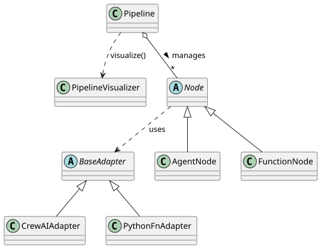

# Maintenance Guide

## Table of Contents

- [Project Structure](#project-structure)
- [Key Features](#key-features)
- [Why This Framework?](#why-this-framework)
- [Basics](#basics)
- [How to Maintain](#how-to-maintain)
  - [Creating a Function Node](#creating-a-function-node)
  - [Creating an Agent Node](#creating-an-agent-node)
  - [Building a Pipeline](#building-a-pipeline)
    - [Option 1: Linear Pipeline (list of nodes)](#option-1-linear-pipeline-list-of-nodes)
    - [Option 2: Graph-based Pipeline (start node + edges)](#option-2-graph-based-pipeline-start-node--edges)
    - [Merging Pipelines](#merging-pipelines)
    - [Nested Pipelines](#nested-pipelines)
    - [Edge Conditions](#edge-conditions)
    - [Creating Loops](#creating-loops)
    - [Creating Adapters](#creating-adapters)
- [Testing](#testing)
  - [Testing Individual Nodes](#testing-individual-nodes)
  - [Testing Pipelines Using Mock Values](#testing-pipelines-using-mock-values)
- [Error Handling](#error-handling)
  - [Node-Level Error Handling](#node-level-error-handling)
  - [Pipeline-Level Error Handling](#pipeline-level-error-handling)
- [Logging](#logging)
- [Performance Optimization](#performance-optimization)
- [Troubleshooting](#troubleshooting)

## Project Structure

```
pipeline_node_agents/
├── src/pipeline_node_agents/
│   ├── core/
│   │   ├── node.py          # FunctionNode, AgentNode definitions
│   │   └── pipeline.py      # Pipeline orchestration
│   ├── adapters/            # Adapters for different execution backends
│   └── examples/            # Example pipelines
├── docs/                    # Documentation
├── logs/                    # Logs, saved locally
├── pyproject.toml
└── README.md
```



## Key Features

- **Local LLM support**: Works with Ollama for fully offline AI pipelines
- **Modular architecture**: Compose pipelines from reusable function and agent nodes
- **Flexible flow control**: Support for linear pipelines, conditional branching, and loops
- **Adapter pattern**: Easy integration with different AI backends (CrewAI, LangChain, custom LLMs)
- **Nested pipelines**: Run sub-pipelines within nodes for complex workflows

## Why This Framework?

- **Easy to maintain**: Build pipelines of any complexity to provide context clearly and friendly for lightweight LLMs
- **Easy to extend**: Integrate with any AI agent framework by adding new adapters without modifying core pipeline logic
- **Easy to test**: Each node can be tested independently with mock outputs

## Basics

Every pipeline built in this framework consists of Nodes, which take some values as input and return one value as output. The main goal of maintenance is to build a schema of Nodes that will process data efficiently. The original framework has 2 types of nodes: Agent node and Function node. Agent node processes the data using an LLM which works with the corresponding adapter and returns the result. Function node executes any Python function using the corresponding adapter.

## How to Maintain

Please add your custom pipelines into the `examples` folder. Feel free to use existing pipelines as templates.

### Creating a Function Node

```python
from pipeline_node_agents.adapters.python_fn_adapter import PythonFnAdapter
from pipeline_node_agents.core.node import FunctionNode

def my_function(input_value: int) -> int:
    return input_value * 2

node = FunctionNode(
    name="MyNode",
    adapter=PythonFnAdapter(my_function),
    inputs=["input_value"],
    output="output_value"
)
```

### Creating an Agent Node

```python
from pipeline_node_agents.core.node import AgentNode

node = AgentNode(
    name="MyAgentNode",
    adapter=your_adapter,  # Use an appropriate adapter from adapters/
    inputs=["data"],
    output="result"
)
```

### Building a Pipeline

#### Option 1: Linear Pipeline (list of nodes)

For simple sequential pipelines, pass a list of nodes:

```python
from pipeline_node_agents.core.pipeline import Pipeline

pipeline = Pipeline(nodes=[node1, node2, node3])
result = pipeline.run(initial_context={"input_value": 5})
```

This creates edges: `node1 -> node2 -> node3`

#### Option 2: Graph-based Pipeline (start node + edges)

For pipelines with conditional branching or complex flows:

```python
from pipeline_node_agents.core.pipeline import Pipeline

# Create pipeline with a start node
pipeline = Pipeline(start_node=decision_node)

# Add additional nodes
pipeline.add_node(branch_a_node)
pipeline.add_node(branch_b_node)

# Add conditional edges
pipeline.add_edge(
    "DecisionNode",
    "BranchANode",
    condition=lambda ctx: ctx["choice"] == "A"
)
pipeline.add_edge(
    "DecisionNode",
    "BranchBNode",
    condition=lambda ctx: ctx["choice"] == "B"
)

result = pipeline.run(initial_context={"choice": "A"})
```

#### Merging Pipelines

You can merge an existing pipeline into another:

```python
sub_pipeline = Pipeline(nodes=[search_node, scrape_node, summarize_node])

main_pipeline = Pipeline(start_node=start_node)
main_pipeline.add_pipeline(sub_pipeline)
main_pipeline.add_edge("StartNode", "SearchNode")
```

#### Nested Pipelines

You can run a pipeline inside a function node for complex sub-workflows:

```python
def process_items(items: list[str]) -> dict:
    """Run a sub-pipeline for each item and aggregate results."""
    results = {}
    
    for item in items:
        # Define nodes for sub-pipeline
        # search_node = FunctionNode(...)
        # process_node = AgentNode(...)
        
        sub_pipeline = Pipeline(nodes=[search_node, process_node])
        result = sub_pipeline.run({"query": item})
        results[item] = result.get("output")
    
    return {"aggregated_results": results}

# Use the function as a node in the main pipeline
nested_node = FunctionNode(
    name="NestedPipelineNode",
    adapter=PythonFnAdapter(process_items),
    inputs=["items"],
    output="aggregated_results"
)

main_pipeline = Pipeline(nodes=[nested_node, final_node])
```

This pattern is useful when you need to dynamically run pipelines based on runtime data.

#### Edge Conditions

- **Unconditional edge**: `condition=None` (default) — always follows this edge
- **Conditional edge**: `condition=lambda ctx: <bool>` — follows edge only if condition returns `True`

When multiple edges exist from a node, the first edge whose condition evaluates to `True` is taken.

#### Creating Loops

To create loops, add an edge back to a previous node:

```python
pipeline.add_edge(
    "ProcessNode",
    "CheckNode",
    condition=lambda ctx: ctx["retry_count"] < 3
)
pipeline.add_edge(
    "CheckNode",
    "ProcessNode",
    condition=lambda ctx: not ctx["success"]
)
pipeline.add_edge(
    "CheckNode",
    "FinalNode",
    condition=lambda ctx: ctx["success"]
)
```

#### Creating Adapters

If you want to use your own agent framework, feel free to add the corresponding adapter to the agent node. Simply inherit your custom adapter class from `BaseAdapter` and implement the `invoke` method.

The adapter's `invoke` method can accept any input fields, but it has to return only one output. 

## Testing

### Testing Individual Nodes

Function nodes can be tested using standard unit tests.

```python
def test_my_function_node():
    node = FunctionNode(
        name="TestNode",
        adapter=PythonFnAdapter(my_function),
        inputs=["input_value"],
        output="output_value"
    )
    
    context = {"input_value": 5}
    result = node.execute(context)
    
    assert result["output_value"] == 10
```

As agent nodes are not deterministic, they cannot be tested with standard instruments. However, it is better to test nodes separately before building them into a complicated pipeline.

### Testing Pipelines Using Mock Values

Use mock values for testing without external dependencies using the optional `mock_value` argument in the node constructor. Example:

```python
mock_node = AgentNode(
    name="MockNode",
    adapter=MockAdapter("mocked_data"),
    inputs=["query"],
    output="result",
    mock_value="My custom mock output"    # <--- Put mock value here, and it will be returned instead of result right away
)
```

This can be particularly useful when debugging a complex pipeline: you do not need to wait for the first nodes to complete their calculations in order to test a node in the middle - just mock the output, and that’s it.

Note: Do not forget to remove all mock_values before deployment.

## Error Handling

### Node-Level Error Handling

Add error handling within your functions:

```python
def safe_function(input_value: int) -> dict:
    try:
        result = risky_operation(input_value)
        return {"output": result, "error": None}
    except Exception as e:
        return {"output": None, "error": str(e)}
```

### Pipeline-Level Error Handling

Wrap pipeline execution in try-except blocks:

```python
try:
    result = pipeline.run(context)
except Exception as e:
    logger.error(f"Pipeline failed: {e}")
    # Handle gracefully or re-raise
```

## Logging

The framework uses Python's logging module. Initialize logging in your pipelines:

```python
from pipeline_node_agents.core.logging_config import get_logger
from pipeline_node_agents.core.logger_bootstrap import init_pipeline_logger

def main():
    # Replace "my_pipeline" with your pipeline name
    init_pipeline_logger(pipeline_name="my_pipeline")
    logger = get_logger(__name__)
    
    logger.info("Starting pipeline execution")
    # ... your pipeline code
```

Logs are automatically saved to the `logs/<pipeline_name>/` directory.

## Performance Optimization

### Use Appropriate max_results

Limit search results to avoid unnecessary processing:

```python
results = WebSearcher.duckduckgo_search(query, max_results=3)  # Not 50
```

### Timeout Configuration

Set reasonable timeouts for network operations:

```python
Scraper._scrape_url(url, timeout=10, max_attempts=3)
```

### Context Size Management

Keep context dictionaries lean - only pass necessary data between nodes.


## Troubleshooting

**Issue: Node outputs not available in subsequent nodes**
- Check that output names match the input names of the next node
- Verify the node returns a dictionary with the correct single key

**Issue: Pipeline hangs or runs forever**
- Check loop conditions - ensure they eventually evaluate to `False`
- Add logging to track execution flow
- Set maximum iteration limits

**Issue: LLM/Agent node fails**
- Verify Ollama is running: `ollama serve`
- Check the model is installed: `ollama list`
- Ensure the adapter is correctly configured

**Issue: Import errors**
- Verify all dependencies are installed: `poetry install`
- Check Python path includes the project root

**Issue: Search results are irrelevant or in wrong language**
- Set the `region` parameter explicitly (e.g., `region='us-en'`)
- Use the newer `ddgs` package instead of `duckduckgo_search`

For more help, check the example pipelines in the `examples/` directory.
